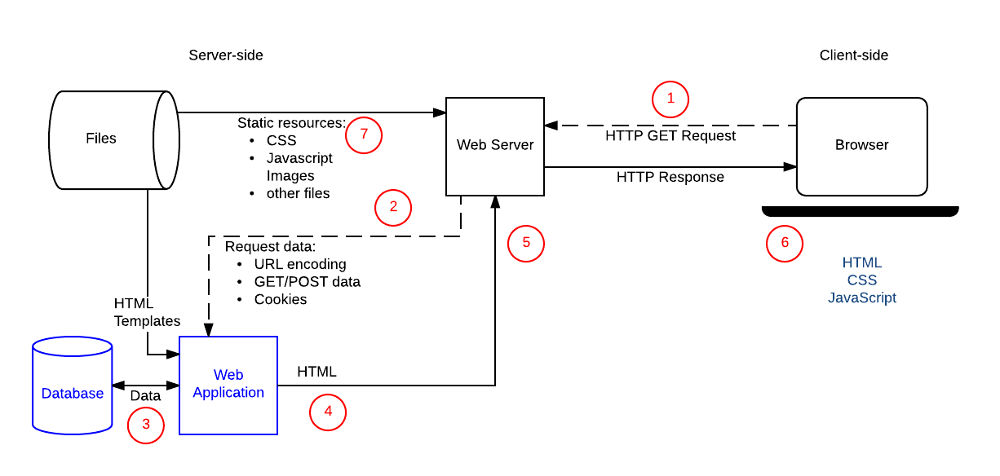

# La notion de front-end

Le dévleoppement web se découpe traditionnellement en deux métiers distincts. D'une part, le métier de développeur front-end, d'autre part le métier de développeur back-end. Bien que l'on se retrouve très souvent avec des personnes dans l'obligation de remplir ces deux tâches, il s'agit véritablement de fonction distinctes qui font appelle à des modes de développements différents, tant du point de vue du langage que des résultats visibles.

Par front-end et back-end, on distinge en fait deux morceaux de la chaîne de communication qui permet à un site de fournir une information à l'utilisateur. Cette distinction se pose entre ce qui est calculé du côté serveur, c'est-à-dire la machine qui héberge le site web, et du côté client, c'est à dire du côté de l'ordinateur de l'utilisateur.

Dans le cas d'une ouverture de page web telle que le repository github de ce cours, on distinguera deux types d'interactions avec la page : d'une part, le calcul par le serveur de ce qui est demandé et la communication des données sous la forme d'une page html, d'autre part le calcul par l'ordinateur de l'utilisatrice de ce que veut dire l'ensemble des tags html, des styles CSS et des fonctions javascript qui produisent le résultat visuel pour la lectrice.

Sur l'image suivante, où les étapes sont montrées dans leur ordre écrit en rouge, on distingue la gestion par le serveur de la selection des fichiers à envoyer du rendu final executé par le navigateur en étape 6.
 
*(Changement de slide)*

## Client ou front-end

Le front-end connaît trois langages principaux : le html, le css et le javascript. Ces trois langages ont connu des versions différentes. Les version actuelles sont : HTML5, CSS3 et Javascript ES7 (où ES veut dire Ecmascript).

*(Changement de slide)*

La reponsabilité de ces langages peut-être distinguées comme suit : le html est responsable de la structuration de l'information, le css pour la mise en page (style, découpage graphique de la page, animations de transition), le javascript pour l'interaction (automatiquement convertir du texte en markdown, récupérer des informations sur d'autres sites, réaliser des objets complexes, d'une carte à un carroussel/slideshow)

(*Demander si il y a des questions*)

(*Changement de slide*)

# La notion de framework

Un framework, ou cadriciel bien que le terme français ne soit JAMAIS utilisé, est un ensemble de composant permettant de développer rapidement l'architecture d'un logiciel (il faut comprendre ici logiciel au sens large : design web, application web, application native, etc.).

Un framework fournit ainsi les éléments essentiels et estimés basiques pour le développement applicatif. À la différence d'une librairie (ou bibliothèque) qui sert un objectif précis, le framework n'est qu'un ensemble d'outil et de matériaux auxquels il convient de donner sens dans le cadre de son propre développement. 

Pour prendre un parallèle, on peut penser les legos comme un framework. Ils fournissent un ensemble de pièces diverses qui, assemblées par des personnes différentes, créeront des résultats très variés.

(*Changement de slide*)

 Cependant, les formes de bases contraignent au final le résultat : on ne peut pas produire un BB8 totalement rond, car les pièces ne le permettent pas. C'est un des défauts des frameworks : ils conditionnent souvent les possibles.

Même si le résultat est conditionné, il reste très avantageux d'utiliser un framework : cela rend beaucoup plus rapide et souvent sécurisé le déveloopement des bases d'une applications. Dans le cadre d'une application web, il gèrera par exemple la connexion à une base de données qu'il faudra juste paramètrer.

(*Changement de slide*)

# Les frameworks front-end

*Article Source : AltiCreations, Introduction aux frameworks front-end (Bootstrap, Foundation) ,  https://www.alticreation.com/bootstrap-foundation-frameworks-front-end/*

# Avantages des frameworks front-end

# Défauts des frameworks front-end

# Quelques exemples

# Bootstrap